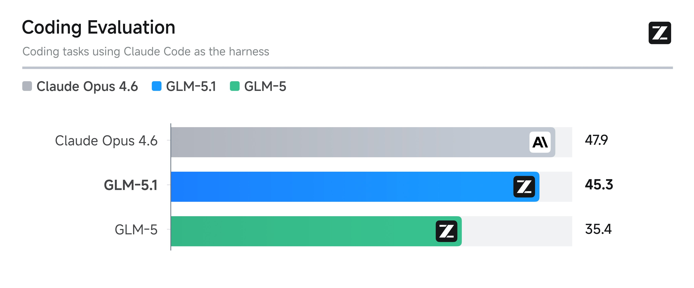

在我的日常开发中，使用的最多的模型之一就是 GLM-5，应该是目前国内最好的编程语言模型了。当然，如果算上国外的模型，最好的还是 Claude Opus 4.6。但是 Opus 4.6 最大的问题，就是它的价格太贵，没办法实现 Token 自由。有次，我只给 Opus 4.6 发了两个字：“好的”，就花费了 **1.7$**，心疼的要死。

但是 Opus 编程强是真的强，很多时候可以一遍过，而 GLM-5 需要反复修改，和 Opus 还有一些差距。最近，智谱上线了全新的 GLM-5.1，编程能力得到巨大的提升，和 Opus 4.6  已经非常接近了。

我买的是智谱的 Coding Plan Pro 版本，所以第一时间用上了 GLM-5.1。只需要把之前模型配置里的 GLM-5，改成 GLM-5.1 即可生效。国内各大厂商都推出了自己的 Coding Plan，我来讲讲为什么我选择了智谱。

1. 国内编程能力最好的模型了
2. 智谱官方的 Coding Plan，更新快，能第一时间用上最新模型
3. 价格实惠，性价比高，包年后用着不心疼

像阿里云百炼、字节的火山方舟、腾讯云、百度千帆等推出的 Coding Plan，都包含了 GLM 模型。但他们的 GLM 模型更新不会那么快，他们需要等智谱把最新的模型完全开源了，再部署好才能开放给用户使用。所以，存在一定的滞后性。比如，现在字节的火山方舟，还只能使用 GLM-4.7 的版本。其他几家，目前也没有上线 GLM5.1。

其次，我们会发现这些大厂的 Coding Plan 的计费模式，是按“次请求”进行计费的。 比如，18000 次/月。看着数字很大，其实这 18000 并不是我们在对话里输入 Prompt 的次数，而是实际的请求调用的次数。

比如，我们在对话框里输入了：“帮我重构一下这段代码”。在后台，会执行很多次的模型调用，大约是 5～30 次。所以，18000 次/ 月，大概能对话 600~3600 轮。

而智谱的 Coding Plan，是按 Prompt 次数计费的。Lite 版本每周 400  次 Prompts，每月就是 1600 轮对话。Pro 版本每周 2000 次 Prompts，每个月就是 8000 轮对话。所以，智谱的 Coding Plan 天然适合复杂的代码编程类任务、 以及 Agent 自动开发类任务。只要你不是拿它来进行全职工作，一般情况下是够用的。

如果遇到每 5 小时超限了，或者每周超限了，就强制休息休息，也挺好。如果实在有 Token（词元）焦虑，我还有一点省 Token 的小技巧。

比如，我们都知道 OpenClaw 小龙虾，是 Token 消耗大户。如果你是资产大佬，不在乎消耗，把 OpenClaw 模型默认配置成 Claude Opus 4.6，每个月花费个几千刀也不心疼的，我也不会说什么。但如果是像我这种普通个人使用，还是尽量能省则省。我会在 OpenClaw 里配置多个模型，不同的 Agent 使用不同的模型，不同的任务也使用不同的模型。

比如 OpenClaw 里的心跳任务，以及 cron 计划任务，我会把它配置成免费的模型。免费的模型从哪里来？其实是有的，就是 OpenRouter。注册新建 API Key 之后，是有不少免费模型可以选的，比如：`z-ai/glm-4.5-air:free` 以及 `minimax/minimax-m2.5:free` 等等。对于执行一些简单计划任务，已经足够了，关键还是免费。

GLM-5.1 模型我还在体验中，如果你也想第一时间上手，欢迎使用我的邀请链接进行购买。首购低至 8 折再减 5%：

链接：[https://www.bigmodel.cn/glm-coding?ic=MRJ3AYGDEG](https://www.bigmodel.cn/glm-coding?ic=MRJ3AYGDEG)

